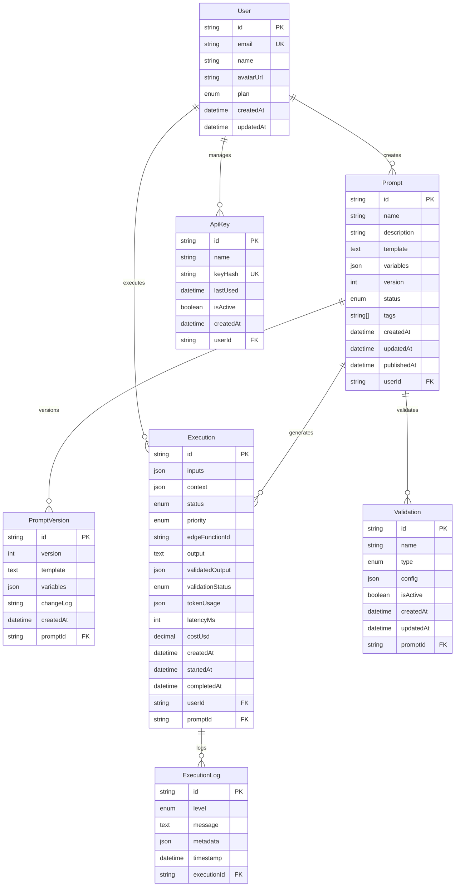

# Database Design

## Entity Relationship Diagram



## Complete Prisma Schema

```prisma
// prisma/schema.prisma
generator client {
  provider = "prisma-client-js"
}

datasource db {
  provider = "postgresql"
  url      = env("DATABASE_URL")
}

// ================================
// USERS & AUTHENTICATION
// ================================

model User {
  id        String   @id @default(uuid())
  email     String   @unique
  name      String?
  avatarUrl String?
  plan      UserPlan @default(FREE)
  createdAt DateTime @default(now())
  updatedAt DateTime @updatedAt

  // Relations
  prompts    Prompt[]
  executions Execution[]
  apiKeys    ApiKey[]

  @@map("users")
}

enum UserPlan {
  FREE
  PRO
  ENTERPRISE
}

// ================================
// PROMPT MANAGEMENT
// ================================

model Prompt {
  id          String       @id @default(uuid())
  name        String
  description String?
  template    String       // Large text field for prompt template
  variables   Json         // Variable definitions with types and constraints
  version     Int          @default(1)
  status      PromptStatus @default(DRAFT)
  tags        String[]     @default([])

  // Timestamps
  createdAt   DateTime  @default(now())
  updatedAt   DateTime  @updatedAt
  publishedAt DateTime? // When status changed to PUBLISHED

  // Foreign Keys
  userId String
  user   User   @relation(fields: [userId], references: [id], onDelete: Cascade)

  // Relations
  executions  Execution[]
  validations Validation[]
  versions    PromptVersion[]

  @@map("prompts")
  @@index([userId, status])
  @@index([createdAt])
  @@index([status, publishedAt])
}

model PromptVersion {
  id        String   @id @default(uuid())
  version   Int
  template  String
  variables Json
  changeLog String?
  createdAt DateTime @default(now())

  // Foreign Keys
  promptId String
  prompt   Prompt @relation(fields: [promptId], references: [id], onDelete: Cascade)

  @@map("prompt_versions")
  @@unique([promptId, version])
  @@index([promptId, createdAt])
}

enum PromptStatus {
  DRAFT
  PUBLISHED
  ARCHIVED
}

// ================================
// EXECUTION ENGINE
// ================================

model Execution {
  id String @id @default(uuid())

  // Input Data
  inputs  Json  // Variable values used for execution
  context Json? // Additional context data

  // Execution Details
  status          ExecutionStatus @default(PENDING)
  priority        Priority        @default(NORMAL)
  edgeFunctionId  String?         // Edge function execution identifier

  // Results
  output           String? // Raw AI response
  validatedOutput  Json?   // Post-validation structured data
  validationStatus ValidationStatus @default(PENDING)

  // Performance Metrics
  tokenUsage Json?    @db.JsonB // Input/output token counts and model info
  latencyMs  Int?     // Execution time in milliseconds
  costUsd    Decimal? @db.Decimal(10, 6) // Cost in USD with 6 decimal precision

  // Timestamps
  createdAt   DateTime  @default(now())
  startedAt   DateTime? // When execution actually began
  completedAt DateTime? // When execution finished (success or failure)

  // Foreign Keys
  userId   String
  user     User   @relation(fields: [userId], references: [id])
  promptId String
  prompt   Prompt @relation(fields: [promptId], references: [id])

  // Relations
  logs ExecutionLog[]

  @@map("executions")
  @@index([userId, status])
  @@index([createdAt])
  @@index([promptId, createdAt])
  @@index([status, createdAt])
  @@index([userId, createdAt])
}

enum ExecutionStatus {
  PENDING
  RUNNING
  COMPLETED
  FAILED
  CANCELLED
}

enum ValidationStatus {
  PENDING
  PASSED
  FAILED
  SKIPPED
}

enum Priority {
  LOW
  NORMAL
  HIGH
  CRITICAL
}

// ================================
// VALIDATION SYSTEM
// ================================

model Validation {
  id       String         @id @default(uuid())
  name     String
  type     ValidationType
  config   Json           @db.JsonB // Validation configuration (schema, regex, function)
  isActive Boolean        @default(true)

  createdAt DateTime @default(now())
  updatedAt DateTime @updatedAt

  // Foreign Keys
  promptId String
  prompt   Prompt @relation(fields: [promptId], references: [id], onDelete: Cascade)

  @@map("validations")
  @@index([promptId, isActive])
}

enum ValidationType {
  SCHEMA   // JSON Schema validation
  REGEX    // Regular expression matching
  FUNCTION // Custom JavaScript function
}

// ================================
// LOGGING & AUDIT
// ================================

model ExecutionLog {
  id        String   @id @default(uuid())
  level     LogLevel @default(INFO)
  message   String
  metadata  Json?    @db.JsonB
  timestamp DateTime @default(now())

  // Foreign Keys
  executionId String
  execution   Execution @relation(fields: [executionId], references: [id], onDelete: Cascade)

  @@map("execution_logs")
  @@index([executionId, timestamp])
  @@index([level, timestamp])
}

enum LogLevel {
  DEBUG
  INFO
  WARN
  ERROR
}

// ================================
// API KEY MANAGEMENT
// ================================

model ApiKey {
  id       String    @id @default(uuid())
  name     String
  keyHash  String    @unique // SHA-256 hash of the actual API key
  lastUsed DateTime?
  isActive Boolean   @default(true)
  createdAt DateTime @default(now())

  // Foreign Keys
  userId String
  user   User   @relation(fields: [userId], references: [id], onDelete: Cascade)

  @@map("api_keys")
  @@index([userId, isActive])
}
```

## Index Strategy

### Performance-Critical Indexes

```sql
-- User queries (most common)
CREATE INDEX idx_prompts_user_status ON prompts(user_id, status);
CREATE INDEX idx_executions_user_created ON executions(user_id, created_at DESC);

-- Execution queries
CREATE INDEX idx_executions_status_created ON executions(status, created_at DESC);
CREATE INDEX idx_executions_prompt_created ON executions(prompt_id, created_at DESC);

-- Logging queries
CREATE INDEX idx_execution_logs_execution_time ON execution_logs(execution_id, timestamp DESC);

-- Search and filtering
CREATE INDEX idx_prompts_status_published ON prompts(status, published_at DESC) WHERE status = 'PUBLISHED';
CREATE INDEX idx_executions_user_status ON executions(user_id, status) WHERE status IN ('RUNNING', 'FAILED');

-- API key lookups
CREATE INDEX idx_api_keys_hash ON api_keys(key_hash) WHERE is_active = true;
```

### Composite Index Rationale

**prompts(user_id, status)**: Most queries filter by user first, then status  
**executions(user_id, created_at DESC)**: Dashboard queries need recent executions per user  
**executions(status, created_at DESC)**: Admin monitoring needs recent executions by status  
**execution_logs(execution_id, timestamp DESC)**: Log queries always filter by execution and need chronological order

## Database Constraints

### Business Logic Constraints

```sql
-- Ensure cost is non-negative
ALTER TABLE executions ADD CONSTRAINT chk_cost_positive
  CHECK (cost_usd IS NULL OR cost_usd >= 0);

-- Ensure latency is positive
ALTER TABLE executions ADD CONSTRAINT chk_latency_positive
  CHECK (latency_ms IS NULL OR latency_ms > 0);

-- Ensure completion timestamp after start timestamp
ALTER TABLE executions ADD CONSTRAINT chk_completion_order
  CHECK (completed_at IS NULL OR started_at IS NULL OR completed_at >= started_at);

-- Ensure version numbers start at 1
ALTER TABLE prompts ADD CONSTRAINT chk_version_positive
  CHECK (version >= 1);

-- Ensure unique version per prompt
-- (Already handled by unique constraint in Prisma)
```

### Data Integrity Rules

```sql
-- Execution status logic
ALTER TABLE executions ADD CONSTRAINT chk_execution_status_logic
  CHECK (
    (status = 'PENDING' AND started_at IS NULL AND completed_at IS NULL) OR
    (status = 'RUNNING' AND started_at IS NOT NULL AND completed_at IS NULL) OR
    (status IN ('COMPLETED', 'FAILED', 'CANCELLED') AND started_at IS NOT NULL AND completed_at IS NOT NULL)
  );

-- Published prompts must have published_at timestamp
ALTER TABLE prompts ADD CONSTRAINT chk_published_timestamp
  CHECK (
    (status != 'PUBLISHED' OR published_at IS NOT NULL)
  );
```

## Migration Scripts

### Initial Migration (001_initial_setup)

```sql
-- Create extensions
CREATE EXTENSION IF NOT EXISTS "uuid-ossp";
CREATE EXTENSION IF NOT EXISTS "pg_trgm"; -- For text search

-- Create enums (handled by Prisma)

-- Create tables (handled by Prisma)

-- Create indexes (handled by Prisma + custom)

-- Insert initial data
INSERT INTO users (id, email, name, plan) VALUES
  ('demo-user-id', 'demo@formaops.com', 'Demo User', 'PRO');
```

### Seed Data Script

```typescript
// prisma/seed.ts
import { PrismaClient } from '@prisma/client';

const prisma = new PrismaClient();

async function main() {
  // Create demo user
  const demoUser = await prisma.user.upsert({
    where: { email: 'demo@formaops.com' },
    update: {},
    create: {
      email: 'demo@formaops.com',
      name: 'Demo User',
      plan: 'PRO',
    },
  });

  // Create sample prompts
  const codeReviewPrompt = await prisma.prompt.create({
    data: {
      name: 'AI Code Reviewer',
      description: 'Reviews code for best practices and security',
      template: `Review the following {{language}} code for:
- Code quality and best practices
- Security vulnerabilities
- Performance optimizations

Code:
\`\`\`{{language}}
{{code}}
\`\`\``,
      variables: [
        {
          name: 'language',
          type: 'string',
          required: true,
          defaultValue: 'typescript',
          options: ['typescript', 'javascript', 'python', 'go'],
        },
        {
          name: 'code',
          type: 'string',
          required: true,
          description: 'Code to review',
        },
      ],
      status: 'PUBLISHED',
      publishedAt: new Date(),
      userId: demoUser.id,
    },
  });

  // Create sample validations
  await prisma.validation.create({
    data: {
      name: 'Code Review Schema',
      type: 'SCHEMA',
      config: {
        type: 'object',
        required: ['issues', 'overall_rating'],
        properties: {
          issues: {
            type: 'array',
            items: {
              type: 'object',
              required: ['type', 'severity', 'description'],
              properties: {
                type: { enum: ['security', 'performance', 'style', 'bug'] },
                severity: { enum: ['low', 'medium', 'high', 'critical'] },
                description: { type: 'string' },
                suggestion: { type: 'string' },
              },
            },
          },
          overall_rating: {
            type: 'number',
            minimum: 1,
            maximum: 10,
          },
        },
      },
      promptId: codeReviewPrompt.id,
    },
  });

  // Create sample executions
  await prisma.execution.create({
    data: {
      inputs: {
        language: 'typescript',
        code: 'const user = { password: "123456" }; // Bad practice',
      },
      output:
        '{"issues":[{"type":"security","severity":"high","description":"Hardcoded password"}],"overall_rating":3}',
      validatedOutput: {
        issues: [
          {
            type: 'security',
            severity: 'high',
            description: 'Hardcoded password in code',
          },
        ],
        overall_rating: 3,
      },
      status: 'COMPLETED',
      validationStatus: 'PASSED',
      latencyMs: 2340,
      costUsd: 0.045,
      tokenUsage: {
        input: 156,
        output: 89,
        total: 245,
        model: 'gpt-4',
      },
      startedAt: new Date(Date.now() - 5000),
      completedAt: new Date(),
      userId: demoUser.id,
      promptId: codeReviewPrompt.id,
    },
  });
}

main()
  .catch(e => {
    console.error(e);
    process.exit(1);
  })
  .finally(async () => {
    await prisma.$disconnect();
  });
```

## Query Optimization Examples

### Efficient Dashboard Queries

```typescript
// Get user's recent executions with prompt info
const recentExecutions = await prisma.execution.findMany({
  where: { userId },
  select: {
    id: true,
    status: true,
    latencyMs: true,
    costUsd: true,
    createdAt: true,
    prompt: {
      select: {
        id: true,
        name: true,
      },
    },
  },
  orderBy: { createdAt: 'desc' },
  take: 20,
});

// Aggregated metrics query
const metrics = await prisma.execution.aggregate({
  where: {
    userId,
    createdAt: { gte: new Date(Date.now() - 24 * 60 * 60 * 1000) }, // Last 24h
  },
  _count: { id: true },
  _avg: { latencyMs: true, costUsd: true },
  _sum: { costUsd: true },
});
```

### Search Optimization

```typescript
// Full-text search on prompts
const searchPrompts = await prisma.prompt.findMany({
  where: {
    userId,
    OR: [
      { name: { contains: searchTerm, mode: 'insensitive' } },
      { description: { contains: searchTerm, mode: 'insensitive' } },
    ],
    status: 'PUBLISHED',
  },
  take: 10,
});
```

## Backup Strategy

### Automated Backups

```bash
# Daily backup script
pg_dump $DATABASE_URL | gzip > "backup_$(date +%Y%m%d).sql.gz"

# Retention policy: 30 days local, 90 days remote
find ./backups -name "backup_*.sql.gz" -mtime +30 -delete
```

### Point-in-Time Recovery Setup

```sql
-- Enable WAL archiving (handled by Supabase)
-- Configure continuous archiving
-- Set up recovery procedures
```

This database design provides a solid foundation with proper normalization, performance optimization, and data integrity constraints while remaining maintainable for a portfolio project.
